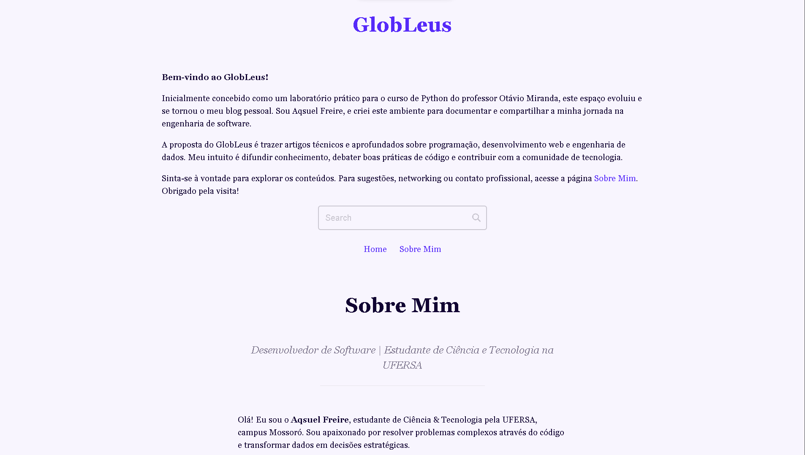

# GlobLeus | Blog Pessoal em Django 🚀

Este projeto é um blog pessoal e técnico desenvolvido com o ecossistema Python e **Django Framework**.

Inicialmente construído como um projeto prático do curso _Python do Básico ao Avançado_ (do professor Otávio Miranda), a aplicação evoluiu para se tornar o meu espaço oficial na web. O objetivo do GlobLeus é documentar estudos, compartilhar soluções de engenharia de software e difundir boas práticas de programação.

  

## ✨ Funcionalidades Principais

- **Class-Based Views (CBVs):** Utilização intensiva de views baseadas em classes no Django para manter o código limpo, modular e reutilizável.
- **Painel Administrativo Customizado:** Área admin do Django profundamente configurada (utilizando `ModelAdmin`) para oferecer gestão total (CRUD) de usuários, posts, categorias, tags e menus de forma 100% visual. Conta também com a integração do **Summernote** (editor WYSIWYG), permitindo a formatação rica e intuitiva do conteúdo das páginas e posts diretamente pelo painel.
- **Arquitetura Modularizada:** Divisão de responsabilidades em múltiplos apps (como o `site_setup` exclusivo para configurações globais do front-end).
- **Relações Reversas e ORM:** Consultas otimizadas e modelagem de dados avançada utilizando `ForeignKeys` e `related_name`.
- **Manipulação de Mídia:** Redimensionamento inteligente e automático de imagens no upload via back-end.

## 🛠️ Tecnologias e Ferramentas

- **Back-end:** Python 3.x, Django Framework, Django Summernote
- **Banco de Dados:** PostgreSQL (Conteinerizado)
- **Infraestrutura/DevOps:** Docker, Docker Compose, Scripts Bash automáticos (`.sh`)
- **Front-end:** HTML5, CSS3 (Variáveis CSS, CSS Fluido), JavaScript
- **Gerenciamento de Dependências:** `requirements.txt`, `python-dotenv`
